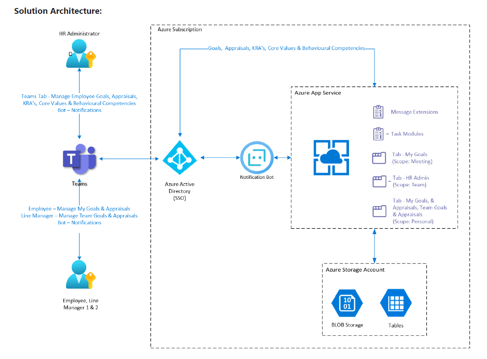

## Overview

The Application template has the following main components:

- [**Azure App Service**](#azure-app-service): Hosts the API endpoints, including the bot messaging endpoint.
- [**Azure Storage Account**](#azure-storage-account): Stores all user conversation references data.
- [**Azure Active Directory**](#azure-active-directory): Provides single sign-on for users in Teams. Also secures communication between the bot and Azure Bot Service.
- [**Microsoft Graph API**](#microsoft-graph-api): Provides integration with O365 for determining user information.

## Azure App Service
This service hosts the Api Endpoint as well as the bot activities required by the solution. The Api endpoint is used for any notifications to be routed to users.

## Azure Storage Account
Azure Storage Account stores all application data in various tables and blobs.

## Azure Active Directory
The Azure Active Directory provides the Authorization for the teams and bot services to be able to communicate securely with each other. Users are also authenticated and authorized against the provider for a single sign on experience. 

## Microsoft Graph API
The Microsoft Graph API is used by the front end to retrieve user information.

Scopes required by the application

| Scope  | Type   | Description  | Admin Consent  |
|---|---|---|---|
| Presence.Read.All  | Delegated  | Read presence information of all users in your organization  | No  |
| User.Read  | Delegated  |  Sign in and read user profile | No  |
| User.Read.All  | Application  | Read all users' full profiles  | Yes  |
| User.ReadBasic.All  | Delegated  | Read all users' basic profiles  | No  |
