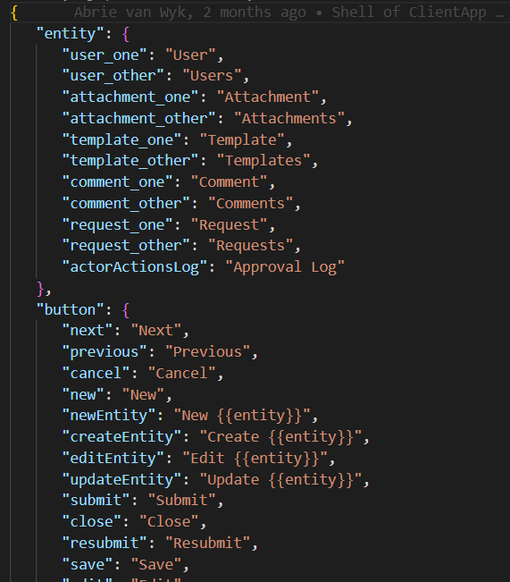
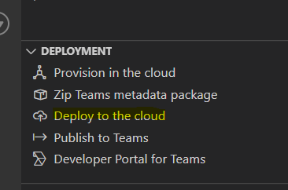

# Localization Guide

## Adding Locales Data

To change the language of labels used in the application, open VS Code and navigate to the 
tabs -> public -> locales folder.

Copy the en folder and rename this folder to the required language e.g. fr-FR.

Once this is done, replace the values in the two common.json and shared.json files with the applicable language strings.

Where there is embedded replacement strings like **{{entity}}** leave this as is. These placeholders will be replaced by other language strings.

Save the files when done editing and via the Teams Toolkit deploy the latest version to the cloud

